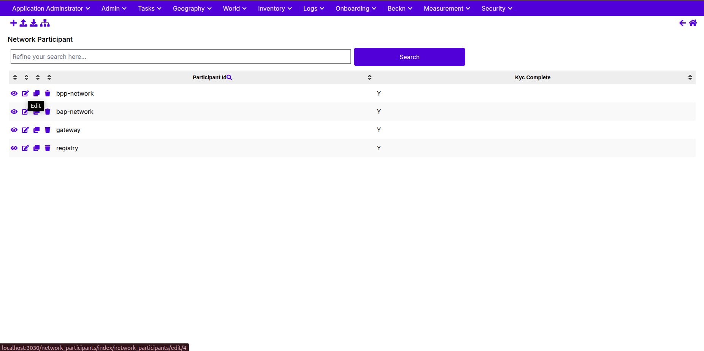
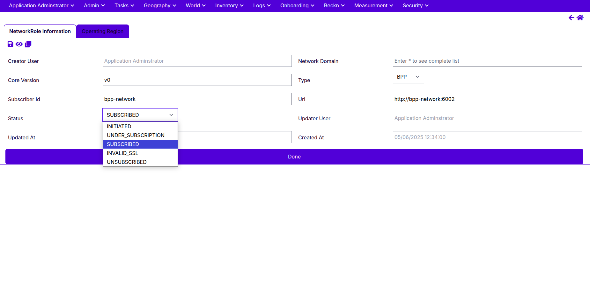

# 🧭 Beckn Onix – Developer Setup Guide

Welcome to the **Beckn Onix** developer guide — your one-stop walkthrough to set up, run, and test a local Beckn network on your machine.

---

## 📦 What Is Beckn Onix?

Beckn Onix is a local reference implementation of the Beckn Protocol — simulating key roles (BAP, BPP, Registry, Gateway) in an open network.

It helps you:
- Understand Beckn’s API and message flow
- Spin up a local Beckn-compatible network
- Run test transactions with Postman
- Extend services for your domain

---

## ⚙️ Prerequisites

Install these tools before starting:

- Docker & Docker Compose
- Node.js & npm
- Postman
- Git
- Unix-like shell (Linux/macOS or WSL on Windows)

---

## 🚀 Getting Started

### 1. Clone & Run Setup

```bash
git clone https://github.com/beckn/beckn-onix.git
cd beckn-onix
chmod +x beckn-onix.sh
./beckn-onix.sh
```

### 2. Verify Containers

```bash
docker ps -a
```

Check that MongoDB, Redis, RabbitMQ, gateway, registry, bap/bpp containers are all up.

---

## 🔐 Login to Registry UI

Open the Registry Admin Panel (e.g. http://localhost:3050)

- **Username**: `root`
- **Password**: `root`


---
## 🧭 UI Workflow – Set BAP Status to `SUBSCRIBED`

1. Go to the **Admin** tab  
2. Click **Network Participant**  
3. Click the ✏️ icon on `bap-network`



4. Switch to the **Network Role** tab


5. Click ✏️ to edit the role  
6. Set **Status** to `SUBSCRIBED`  
7. Click **Done**



---

## 🌐 Add a Network Domain

1. Go to **Beckn > Network Domain**
2. Click **Add**
3. Fill:
   - Name: `retail:1.1.0`
   - Description: `retail:1.1.0`
4. Click **Save & More**


---

## 🧪 Run a Sample Transaction (Retail)

### 1. Import Collection

👉 [Postman Collection – Local Retail 1.1.0](https://github.com/beckn/beckn-sandbox/blob/main/artefacts/local-retail/Local-Retail-Sandbox-110.postman_collection.json)

### 2. Set Postman Environment

| Key                   | Example Value             |
|-----------------------|---------------------------|
| `bap_client_url`      | `http://localhost:5001`   |
| `bap_uri`             | `http://bap-network:5001` |
| `bap_id`              | `bap-network`             |
| `bpp_id`              | `bpp-network`             |
| `bpp_uri`             | `http://localhost:6002`   |


Update these in the **Variables tab** of your collection.

---

### 3. Call These APIs in Order

1. `search`
2. `select`
3. `init`
4. `confirm`
5. *(Optional)*: `status`, `track`, `cancel`

---

## 🧹 Disable Telemetry & Layer2 (Optional for Local)

Inside each Protocol Server:

```bash
docker exec -it bap-client sh
vi config/default.yml
```

Replace the telemetry section with:

```yaml
telemetry:
  enabled: false
  url: ""
  batchSize: 100
  syncInterval: 30
  redis_db: 3

useLayer2Config: false
mandateLayer2Config: false
```

Then:

```bash
pm2 restart 0 1 2
exit
```

Repeat for:

- `sandbox-api`
- `bap-client`
- `bap-network`
- `bpp-client`
- `bpp-network`

---

## 📜 View Logs

```bash
docker logs -f bap-client
docker logs -f bpp-network
docker logs -f gateway
docker logs -f registry
```

Clear Redis cache if stuck:

```bash
docker exec -it redis redis-cli FLUSHALL
```

---


- 🧪 [Detailed End-to-End Transaction Guide](./end2endtxn.md)

---

## 🙌 Done!

You’ve successfully set up a Beckn-compliant local network and can now run test transactions, explore logs, and build apps on top of the protocol.

For support:  
👉 Join the [Beckn Discord](https://discord.com/invite/beckn)  
🌐 Visit [https://becknprotocol.io](https://becknprotocol.io)

---
